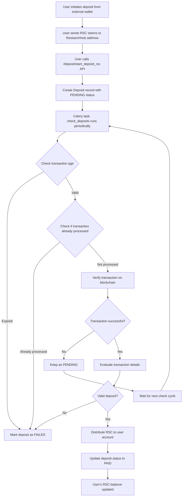

# ResearchHub RSC Deposit Flow

## Overview
The deposit flow enables users to transfer ResearchCoin (RSC) tokens from their external wallets into the ResearchHub platform. The system supports deposits on both Ethereum and Base networks.

## Flow Diagram

## Components

### 1. Deposit Model (`src/reputation/related_models/deposit.py`)
- Stores deposit transaction details
- Fields:
  - `user`: The user making the deposit
  - `amount`: Amount of RSC deposited
  - `network`: Either "BASE" or "ETHEREUM"
  - `from_address`: Sender's wallet address
  - `transaction_hash`: Blockchain transaction hash
  - `paid_status`: PENDING, PAID, or FAILED

### 2. Deposit API (`src/reputation/views/deposit_view.py`)
- **Endpoint**: `POST /api/deposit/start_deposit_rsc`
- **Purpose**: Creates a pending deposit record after user initiates blockchain transaction
- **Required data**:
  - `amount`: Expected deposit amount
  - `from_address`: User's wallet address
  - `transaction_hash`: Blockchain transaction hash
  - `network`: Network used (BASE or ETHEREUM)

### 3. Deposit Verification Task (`src/reputation/tasks.py`)
- **Function**: `check_deposits()`
- **Schedule**: Runs periodically via Celery
- **Process**:
  1. Fetches all PENDING deposits ordered by creation date
  2. For each deposit:
     - Checks if deposit has expired (default TTL)
     - Verifies transaction hasn't been processed before
     - Confirms transaction success on blockchain
     - Validates transaction details (amount, recipient)
     - Distributes RSC to user's account
     - Updates deposit status

### 4. Blockchain Integration
- **Networks supported**: Ethereum mainnet and Base network
- **Token**: ResearchCoin (RSC) ERC-20 token
- **Verification**: Uses Web3.py to interact with blockchain
- **Security**: Validates transaction recipient matches platform address

## Status Flow

1. **PENDING**: Initial status when deposit is created
2. **PAID**: Successfully verified and credited to user
3. **FAILED**: Transaction failed or invalid

## Security Considerations

1. **Race Condition Prevention**: Uses database locks (`select_for_update()`) to prevent double processing
2. **Duplicate Prevention**: Checks if transaction hash already processed
3. **Order Processing**: Processes deposits by creation date to prevent front-running
4. **TTL Expiration**: Deposits expire after set time limit if not confirmed
5. **Future Enhancement**: Planned addition of signed messages to validate wallet ownership

## Error Handling

- Failed blockchain queries keep deposit as PENDING for retry
- Invalid transactions marked as FAILED
- Expired deposits (exceed TTL) marked as FAILED
- Database transactions ensure atomicity of updates

## Distribution Process

When a valid deposit is confirmed:
1. Creates a Distribution object with type "DEPOSIT"
2. Uses the Distributor class to credit RSC to user's account
3. Updates user's balance without giving reputation points (`give_rep=False`)
4. Records the actual deposited amount from blockchain

## Configuration

### Wallet Addresses
- **ResearchHub Deposit Address**: `WEB3_WALLET_ADDRESS` (same address for both networks)
  - This is where users must send their RSC tokens
  - The same wallet address receives deposits on both Ethereum and Base networks

### Token Contract Addresses
- **RSC Token Contracts**:
  - Ethereum: `WEB3_RSC_ADDRESS` - RSC ERC-20 token contract on Ethereum
  - Base: `WEB3_BASE_RSC_ADDRESS` - RSC ERC-20 token contract on Base

### System Settings
- **Max Age**: Configurable TTL for pending transactions (`PENDING_TRANSACTION_MAX_AGE`)
- **Web3 Providers**: Separate Web3 instances for Ethereum and Base networks
- **Environment Variables**: All addresses configured via environment variables for security
