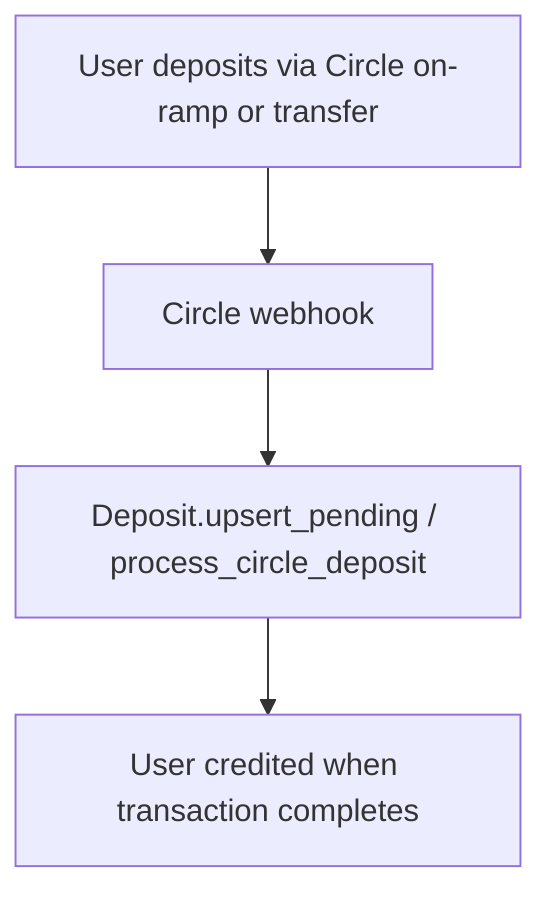
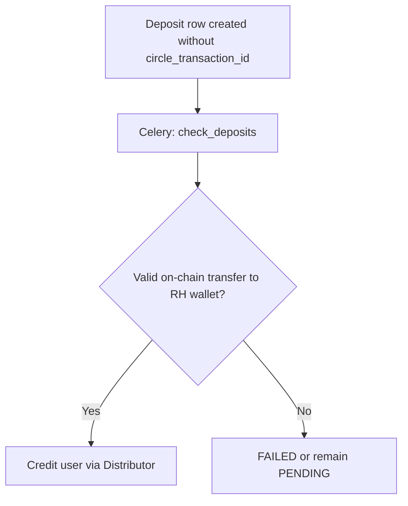

# ResearchHub RSC Deposit Flow

## Overview

Users add RSC to their ResearchHub balance primarily through **Circle** (on-ramp / custodial wallet). A legacy path still exists for **non-Circle** on-chain deposits processed by the `check_deposits` Celery task (admin CLI or historical records).

## Primary flow: Circle

```mermaid
flowchart TD
    A[User deposits via Circle on-ramp or transfer] --> B[Circle webhook]
    B --> C[Deposit.upsert_pending / process_circle_deposit]
    C --> D[User credited when transaction completes]
```

- **Webhook**: `src/purchase/views/circle_webhook_view.py`
- **Service**: `src/purchase/circle/service.py` (`process_circle_deposit`)
- Deposits are keyed by `circle_transaction_id` and credited idempotently.

## Legacy flow: external wallet + `check_deposits`

```mermaid
flowchart TD
    A[Deposit row created without circle_transaction_id] --> B[Celery: check_deposits]
    B --> C{Valid on-chain transfer to RH wallet?}
    C -->|Yes| D[Credit user via Distributor]
    C -->|No| E[FAILED or remain PENDING]
```

- **Task**: `reputation.tasks.check_deposits` (excludes rows with `circle_transaction_id`)
- **Creation**: `process_deposits` management command (ops/dev only). `POST /api/deposit/start_deposit_rsc` has been removed.

## Deposit API (`src/reputation/views/deposit_view.py`)

- **`GET /api/deposit/`** — list the authenticated user's deposits (optional `?paid_status=PENDING`). Used by the web app to poll pending Circle/legacy deposits.

## Deposit model

See `src/reputation/related_models/deposit.py` for fields including `user`, `amount`, `network`, `from_address`, `transaction_hash`, `paid_status`, and Circle-specific fields.

## Configuration

- **ResearchHub hot wallet**: `WEB3_WALLET_ADDRESS`
- **RSC contracts**: `WEB3_RSC_ADDRESS` (Ethereum), `WEB3_BASE_RSC_ADDRESS` (Base)
- **Pending TTL**: `PENDING_TRANSACTION_MAX_AGE` in `reputation.tasks`
