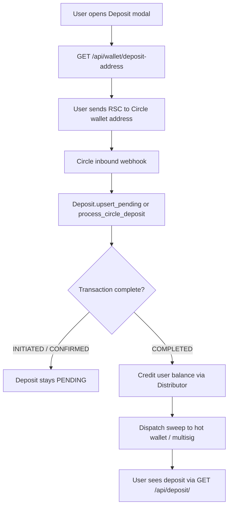

# ResearchHub RSC Deposit Flow

## Overview

Users deposit ResearchCoin (RSC) via Circle Programmable Wallets. Each user receives a dedicated on-chain deposit address; Circle webhooks notify the backend when funds arrive, credit the in-app balance, and sweep funds to ResearchHub treasury wallets.

Legacy self-reported deposits (`POST /api/deposit/start_deposit_rsc` + `check_deposits` Celery task) were removed in favor of this flow.

## Flow Diagram

```mermaid
flowchart TD
    A[User opens Deposit modal] --> B[GET /api/wallet/deposit-address]
    B --> C[User sends RSC to Circle wallet address]
    C --> D[Circle inbound webhook]
    D --> E[Deposit.upsert_pending or process_circle_deposit]
    E --> F{Transaction complete?}
    F -->|INITIATED / CONFIRMED| G[Deposit stays PENDING]
    F -->|COMPLETED| H[Credit user balance via Distributor]
    H --> I[Dispatch sweep to hot wallet / multisig]
    I --> J[User sees deposit via GET /api/deposit/]
```

## Components

### 1. Deposit model (`src/reputation/related_models/deposit.py`)

Stores Circle deposit lifecycle: `circle_transaction_id`, `circle_status`, `sweep_status`, amounts, and on-chain metadata.

### 2. Deposit address API (`src/purchase/views/circle_wallet_view.py`)

- **Endpoint**: `GET /api/wallet/deposit-address`
- **Purpose**: Returns (and lazily provisions) the user's Circle wallet address for inbound RSC.

### 3. Circle webhooks (`src/purchase/views/circle_webhook_view.py`)

- Inbound notifications create or update pending deposits.
- Completed inbound transactions credit the user via `purchase.circle.service.process_circle_deposit`.
- Outbound sweep notifications update `sweep_status`.

### 4. Deposit list API (`src/reputation/views/deposit_view.py`)

- **Endpoint**: `GET /api/deposit/` (optional `?paid_status=PENDING`)
- **Purpose**: Lets the client show pending and historical deposits (used by the web app transaction feed).

## Status flow

1. **PENDING** — Circle transaction in progress (`INITIATED` / `CONFIRMED`).
2. **PAID** — User credited; sweep may still be in progress.
3. **FAILED** — Circle or validation failure.

## Security

- Deposits are tied to Circle wallet ownership (per-user wallet), not user-supplied transaction hashes.
- Webhook signatures are verified before processing.
- Idempotent credit via `circle_transaction_id` prevents double-crediting.
